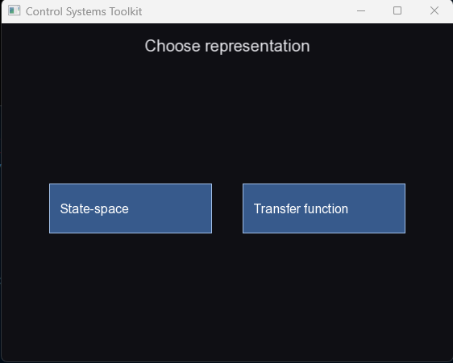
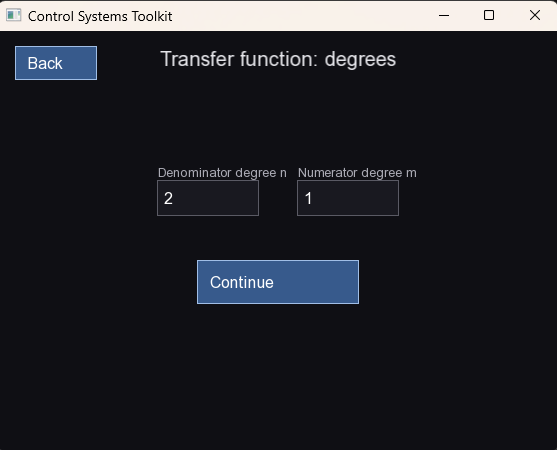
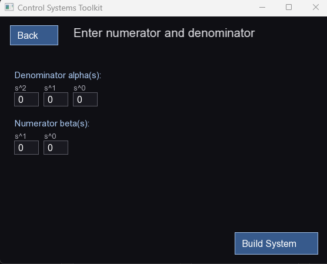
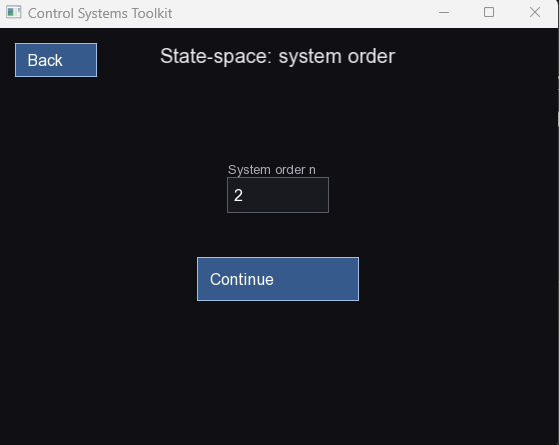
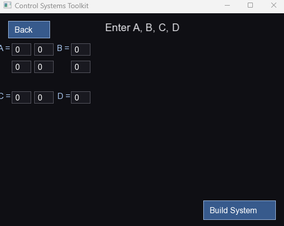
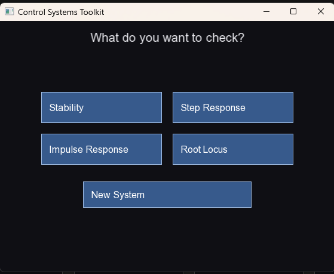
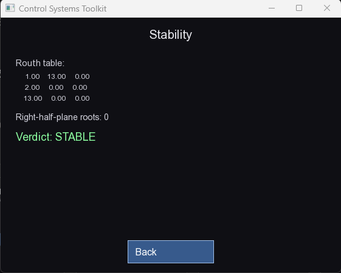
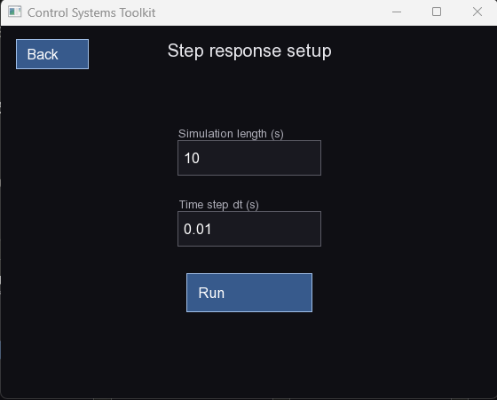
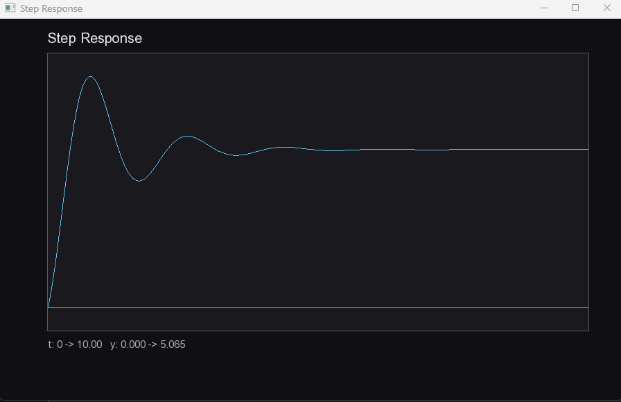
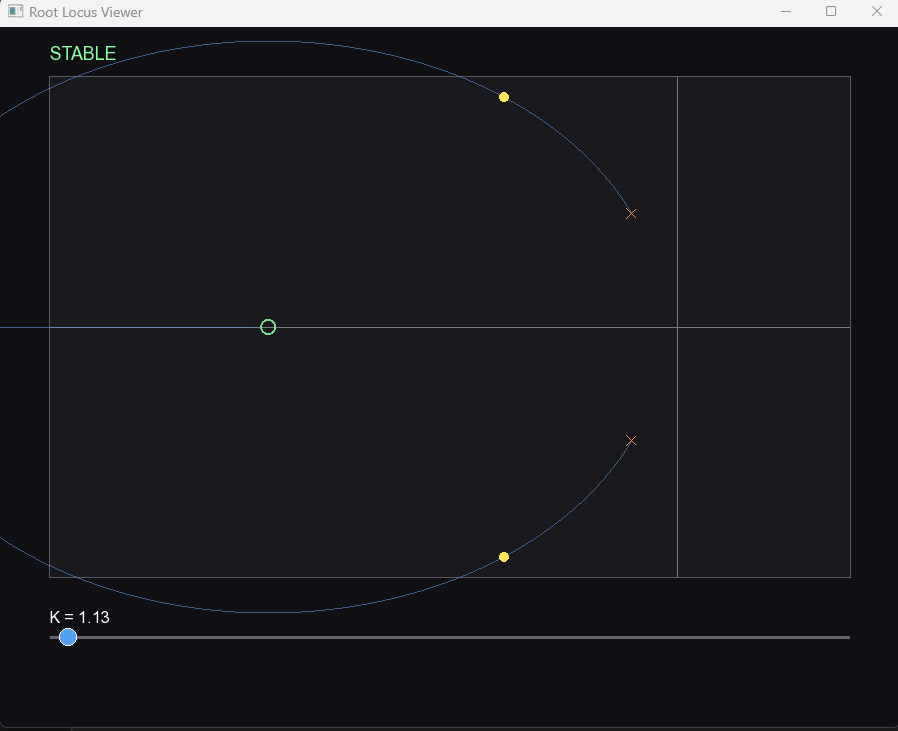

# Control Systems Visualization Tool

**Stability, root locus and step/impulse response for linear control systems — C++17, SFML 3**

A C++ desktop tool for analyzing and visualizing linear control systems — stability, root locus, and step/impulse response — without doing the linear algebra by hand.

## Why this exists

Built alongside a university Control Systems course, following specific techniques from the course's own guide: Faddeev-LeVerrier for the characteristic polynomial, Durand-Kerner for polynomial root-finding, Controllable Canonical Form for state-space realization, Routh-Hurwitz for stability. Doing this analysis by hand for anything past a 3rd-order system means grinding through matrix determinants, polynomial root-finding, and a Routh table just to answer "is this stable" or "what does the root locus look like as K grows" — and one wrong arithmetic step invalidates everything after it. This tool does the actual math instead of a lookup table or a canned example, and lets you *see* the result instead of squinting at a printed list of complex numbers.

## Features

- **Two system representations** — describe a system as state-space matrices (A, B, C, D) or as transfer function coefficients, and convert freely between the two (Faddeev-LeVerrier / Controllable Canonical Form).
- **Stability analysis** — full Routh-Hurwitz table, right-half-plane root count, and a stable / marginally-stable / unstable verdict.
- **Interactive root locus** — branches are tracked by predictive extrapolation as K sweeps, so they don't swap identity near breakaway/break-in points; a live K slider shows the current closed-loop poles and stability in real time. The view **auto-fits** to the system's poles and zeros, and you can **drag to pan**, **scroll to zoom**, and hit **Reset view** to snap back.
- **Step and impulse response** — numerically simulated from the state-space model and plotted as a time-domain graph.
- **Two ways to run it** — a point-and-click GUI (no console at all) for quick use, or a console menu for anyone who'd rather type values at a prompt.

## Walkthrough

### Choosing how to describe the system



Every analysis starts here: describe the system as state-space matrices,
or as a transfer function's coefficients.

### Transfer function input



First pick the numerator/denominator degrees...



...then enter alpha(s) and beta(s) coefficient by coefficient.

### State-space input



For state-space, pick the system order n first...



...then fill in A, B, C, and D.

### Choose what to check



Once the system is built, pick an analysis. "New system" resets back to
step 1 without closing the app.

### Stability



Runs the Routh-Hurwitz table and reports the verdict (stable / marginally
stable / unstable) along with the right-half-plane root count.

### Step response



Set the simulation length and time step...



...then see y(t) plotted. (Impulse response follows the same two screens.)

### Root locus



The closed-loop pole trajectories for K in [0, Kmax], with a draggable
slider that moves K and redraws the current closed-loop poles live —
color-coded green/red for stable/unstable as you cross a stability
boundary.

### The console alternative

`main.exe` offers the exact same analysis through a typed menu instead of buttons — useful for scripting, quick one-off checks, or just preference. Both entry points share the same underlying math and the same plot windows, so results are identical either way.

## Tech Stack

| Layer | Technology |
|---|---|
| Language | C++17 |
| Graphics / UI | SFML 3 |
| Build | Make (Makefile, g++) |
| Target platform | Windows (MSYS2 / MinGW64) — plain g++ + SFML works elsewhere too |

## Architecture

```
Control-Systems-Visualization-Tool
├── include/
│   ├── math/      # ComplexNumber, Matrix, Polynomial
│   ├── control/   # TransferFunction, StateSpace, Conversions, Stability, RootLocus, TimeResponse
│   └── view/      # Plot, Slider, Button, TextField, RootLocusWindow, TimeResponseWindow, LauncherWindow
├── src/           # mirrors include/, plus the two entry points:
│   ├── main.cpp       # console menu           -> main.exe
│   └── main_gui.cpp   # point-and-click launcher, no console -> gui.exe
├── test/
│   └── test_math.cpp  # validation against known analytical results — no SFML needed
└── Makefile
```

- **math/** — general-purpose linear algebra and polynomial root-finding (Durand-Kerner). No control-theory knowledge lives here.
- **control/** — the actual control-systems algorithms: Routh-Hurwitz stability, root locus (with branch identity tracking), time-response simulation, and the two representation conversions.
- **view/** — everything SFML-specific: a reusable `Plot` (world↔screen mapping, pan/zoom), `Button` / `TextField` / `Slider` widgets, and the windows built from them (`LauncherWindow` is the whole point-and-click app; `RootLocusWindow` and `TimeResponseWindow` are the plot windows both entry points share).

## Getting Started

### Prerequisites

- A C++17 compiler (MSYS2 MinGW64 `g++` on Windows, or plain `g++` / `clang++` elsewhere)
- SFML 3 — on MSYS2 MinGW64: `pacman -S mingw-w64-x86_64-sfml`

### Build

```bash
make main   # console menu       -> main.exe
make gui    # point-and-click app -> gui.exe
```

`make clean` removes all build output. `make test_math` builds the math/control validation suite, which has no SFML dependency and always builds even without SFML installed — useful after touching anything under `math/` or `control/`.

### Run

```bash
./gui.exe    # recommended: point-and-click, no console
./main.exe   # console menu
```

On Windows, `gui.exe` has no console window at all, so double-clicking it from Explorer works directly. If you run it from a terminal instead, make sure the SFML DLLs (`C:\msys64\mingw64\bin`) are reachable — either launch it from the MSYS2 MINGW64 shell, or copy the DLLs next to the `.exe`.

## Status

A personal project built alongside a university Control Systems course. Feedback and suggestions are welcome.
